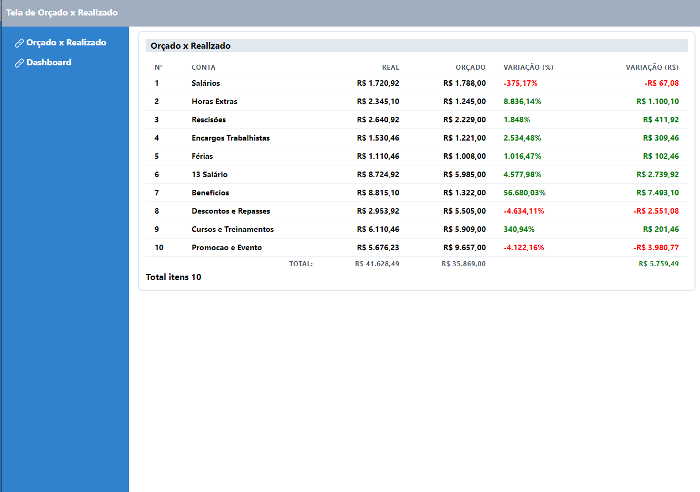
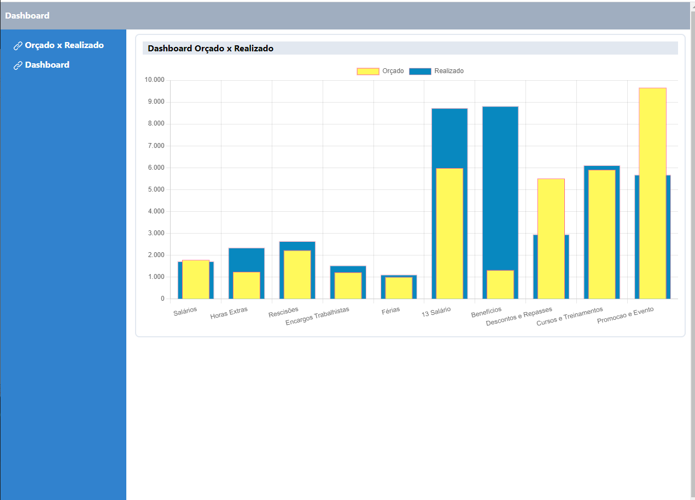

## Screenshots app frontend

#### Page Home

#### Page Dashboard



## Tech Stack

**Client:** React, Nextjs, Chakra UI


## Installation

Clone the project

```bash
  git clone https://github.com/viniciusnascimento95/challenge-sei-sistemas-frontend.git

  cd challenge-sei-sistemas-frontend
```

Install dependencies NPM

```bash
  npm install
```

## Docker

Start database MYSQL

```bash
  docker-compose up
```
*Importar banco de dados para executar projeto*


Start web server Local: http://localhost:3000

```bash
  npm run dev
```

### Challenge developer frontend

- [x] start project in nextjs
- [x] install dependencies from chakra ui
- [x] Config routes app
- [x] Styled project
- [x] Config connection for get data to use project

## REQUISITOS

- [x] FE01 - Tela de Orçado x Realizado
  - [x] "Orcado x Realizado" - Grid contento o relatório comparativo entre valores orçados (previstos) e realizados (gastos). Obs. Os valores estão armazenados no banco MySql Cliente.mwb anexo ao projeto.
  - [ ] Paginação de 10 itens
  - [x] Mostrador de total de itens
  - [x] O relatório deve exibir as colunas (No, Conta, Real, Orcado, Variação (%), Variação (R$)) No – Coluna id_Conta tabela tb_Orcamentos Conta – Coluna Conta tabela tb_Conta Real – Somatório da coluna vlr_real tabela tb_Orcamentos para Conta  Orcado – Somatório da coluna vlr_orcado tabela tb_Orcamentos para Conta  Variacao (%) – Porcentagem da diferença entre o somatório dos valores reais e valores orçados Variacão (R$) – Diferença entre o somatório dos valores reais e valores orçados
  - [x] A coluna "Variacão (R$)" deve ter o valor na cor verde para valores positivos, e vermelhos para valores negativos.
  - [x] O layout deve seguir o exemplo abaixo

- [x] FE02 – Gráfico de Orçado x Realizado
  - [x] Gráfico de barra exibindo o comparativo visual entre os valores orçados x realizados
  - [x] O eixo X deve exibir as Contas, o eixo Y deve exibir os valores somados por conta
  - [x] Cada barra deve representar a Conta com o somatório dos valores orçados para aquela conta sobre o somatório dos valores realizados para a mesma conta
  - [x] O layout deve seguir o exemplo abaixo
  - [x] A aplicacão deve ser web utilizando React
  - [x] Deve utilizar o banco de dados MySql. Banco Cliente.mwb
  - [x] Deve seguir o layout dos exemplos, não sendo necessário seguir o padrão de cores
  - [x] Os componentes Grid e Gráfico podem ser de livre escolha


## Authors

[@viniciusnascimento95](https://www.github.com/viniciusnascimento95)
[](https://www.linkedin.com/in/vin%C3%ADcius-nascimento-027507159/)